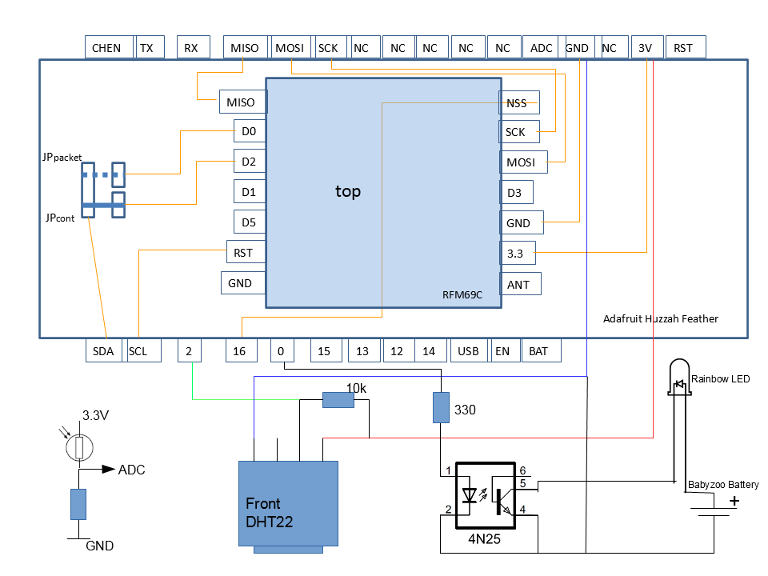
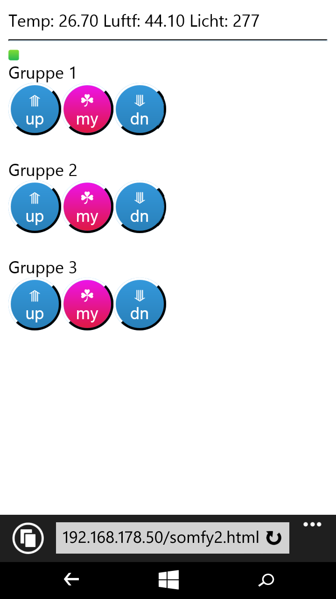
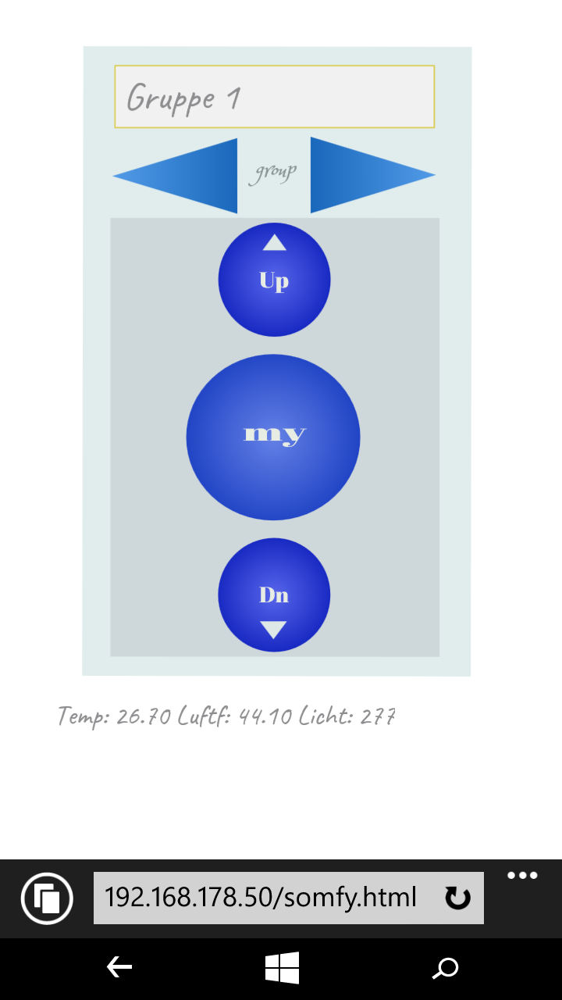
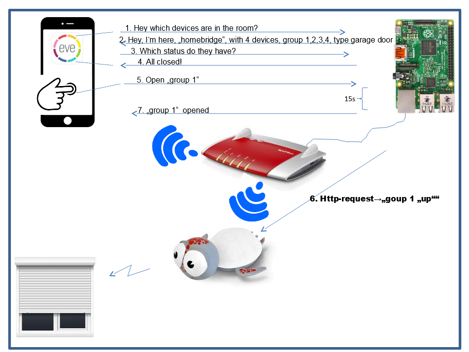

# The Babyzoo Project
A Somfy Remote Control for roller shutters, build into a Babyzoo nightlight, using ESP8266 Wifi Module &amp; RFM69

In this example Adafruit Huzzah Feather and self-made RFM69-feather on-top.

 * Traditional Somfy remotes work within 400Mhz ISM band, which makes it difficult
 * to control elements from e.g. mobile phone or computer.
 *
 * ESP8266 Wifi Module embeds a whole http server functionality hence its
 * interfaces can be controlled through a WLAN enabled device with Web Browser, it is
 * a good candidate to be used as an emulator for Somfy branded remotes.
 * For that purpose it needs to control an appropriate radio module within 400Mhz band.
 *
 * In this project an RFM69 module is used, bought from some online electronic store. It
 * is controlled via SPI interface.
 
 
 
  * Some pins are free for temperature sensor, light sensor and driving a rainbow led:
  
  
   
  * The Web Interface like this:
  
   or  
  The html source at: https://github.com/maroprjs/Babyzoo/tree/master/libs/BabyzooLib/html
 
 * ..also controllable via apple's voice control Siri using homebridge.....the plugin can be found here: https://github.com/maroprjs/Babyzoo/tree/master/voice_controlled/siri/somfy
 
 Raspberry Pi can be used to host the NodeJs server: 
    
  
  The plugin is modified version of: https://www.npmjs.com/package/homebridge-real-fake-garage-doors
  There are also info's about homebridge installation. 
  
  
 
 
 
 
 *more pics and screen shots are here: https://github.com/maroprjs/Babyzoo/tree/master/libs/BabyzooLib/docs
 
 
 <h2> How to build? </h2>
 If Arduino IDE is used, the content from https://github.com/maroprjs/Babyzoo/tree/master/libs/BabyzooLib and https://github.com/maroprjs/Babyzoo/tree/master/deployment/RCSomfyRFM69 need to be copied into the same project folder.  
 Make sure following libraries are installed:  
 * ESP8266 board environment 
 * OOK library: original https://github.com/kobuki/RFM69OOK/ (original) 
 * 	-> but use xmas2016 branch from https://github.com/maroprjs/RFM69OOK.git (this contains adapted changes for ESP8266) 
 * myWebServer library and dependent from: https://github.com/nailbuster/myWebServer.git (original) 
 *  -> use xmas2016 branch from https://github.com/maroprjs/myWebServer.git (this contains slight changes for password handling) 
 *
 * elapsedMillis from:  https://github.com/pfeerick/elapsedMillis 
 *
 * DHT & sensor library from Adafruit: 
 * 					https://github.com/adafruit/DHT-sensor-library.git 
 * 					https://github.com/adafruit/Adafruit_Sensor.git 
  
 Once the software is running on ESP8266 module, the html files need to be uploaded to http://<esp8266_ip_address>.browse.  
 
 For being able to control the shutter via Apples Homekit App, respectively Siri voice service, a NodeJs server needs to be setup with homebridge installed. Follow the instructions from here https://www.npmjs.com/package/homebridge-real-fake-garage-doors and replace index.js and config file with that one here: https://github.com/maroprjs/Babyzoo/tree/master/voice_controlled/siri/somfy
  
 
  
 <h2> Recognition</h2>
 * Thanks to:
 *  -https://pushstack.wordpress.com/somfy-rts-protocol/
 *  -https://forum.arduino.cc/index.php?topic=208346.60
 *  -fhem cul http://culfw.de/culfw.html
 *  -https://github.com/kobuki/RFM69OOK
 *  -https://github.com/nailbuster/myWebServer
 *  -https://github.com/PaulStoffregen/Time
 *  -https://github.com/bblanchon/ArduinoJson.git version <= v5.8.0
 *  -https://github.com/pfeerick/elapsedMillis
 *  -Adafruit (https://github.com/adafruit/DHT-sensor-library)
 *  -Arduino/ESP8266 contributers
 *  -Hombridge contributers (https://github.com/nfarina/homebridge, https://github.com/plasticrake/homebridge-real-fake-garage-doors and precessors of these projects)
 *  -?
 
